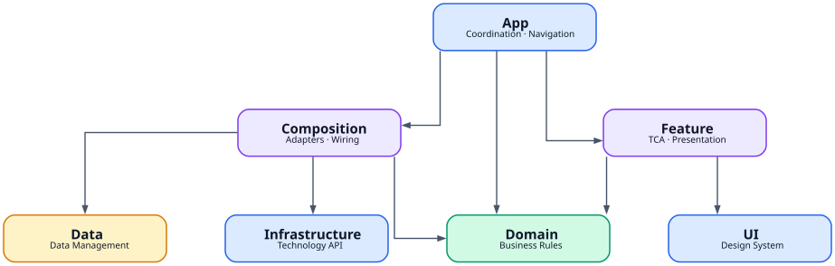
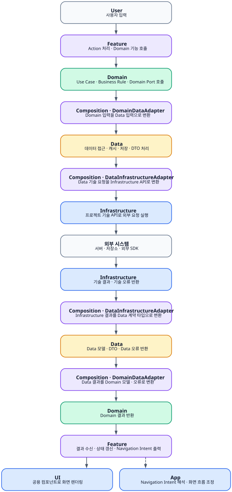

# Git It iOS 아키텍처

**상태**: 초안

**작성일**: 2026-08-07

이 문서는 프로젝트의 패키지 책임, 컴파일 타임 의존성 방향, 의존성 조립 방식과 패키지 경계를 통과하는 제어 흐름을 정의합니다. 패키지 내부의 세부 구현 구조와 개별 기능 설계는 각 패키지 및 기능 문서에서 정의합니다. 프로젝트가 소유하는 공개 API와 경계 값의 이름은 [네이밍 컨벤션](./conventions/naming.md)을 정본으로 따릅니다.

## 1. 설계 설명

현재 아키텍처는 변경 가능성이 높은 Domain과 Data에 높은 테스트 독립성과 변경 격리를 제공합니다. Domain, Data, Infrastructure는 각각 독립적인 경계를 형성하고, Composition이 각 경계 사이의 Adapter와 실행 환경별 구현을 조립합니다.

Feature는 TCA를 이용해 사용자 기능의 상태와 상호작용을 표현합니다. App은 Feature와 Composition을 연결하고 Feature 간 Navigation과 애플리케이션 전체 화면 흐름을 조정합니다. UI는 여러 Feature가 공유하는 시각 언어와 재사용 가능한 UI 구성요소를 제공합니다.

의존성은 생성자 또는 명시적인 초기화 인자를 통해 전달합니다. 이 방식은 각 타입이 요구하는 의존성을 선언부에서 드러내고 테스트에서 필요한 구현을 직접 구성할 수 있도록 합니다.

## 2. 패키지 책임

| 패키지 | 책임 |
|---|---|
| App | Feature와 Composition의 연결, 애플리케이션 전체 Navigation과 화면 흐름 조정 |
| Composition | Domain↔Data, Data↔Infrastructure Adapter 구현, 실행 환경별 구현 선택, 객체 생성과 수명 관리 |
| Feature | TCA 기반 상태 관리, 사용자 상호작용, 화면 구성과 Presentation 흐름 |
| Domain | 비즈니스 모델, 정책, 비즈니스 로직과 외부 기능에 대한 Domain 계약 |
| Data | 데이터 획득·저장·캐시·동기화와 Data 소유 모델·DTO, 외부 기술 기능에 대한 Data 계약 |
| Infrastructure | 외부 라이브러리·프레임워크·플랫폼 기능을 프로젝트 내부 기술 API로 변환 |
| UI | 여러 Feature가 공유하는 디자인 시스템과 재사용 가능한 UI 구성요소 |

### App

App은 **Coordination Layer**로서 Feature가 표현하는 사용자 흐름과 Composition이 제공하는 실행 가능한 Domain 기능을 연결합니다. 또한 Feature 간 Navigation, 애플리케이션 수준의 화면 흐름, 플랫폼 생명주기와 실행 진입점을 담당합니다.

### Composition

Composition은 production dependency graph를 구성하는 조립 경계입니다. Domain과 Data, Data와 Infrastructure 사이의 Adapter를 구현하고 실행 환경에 맞는 구체 구현, 객체 생성 순서와 수명을 결정합니다.

### Feature

Feature는 사용자가 인지하는 기능의 Presentation 경계입니다. TCA 기반 State, Action, Reducer와 화면을 구성하고 사용자 상호작용을 Domain 기능 호출과 Presentation 상태 변화로 연결합니다.

### Domain

Domain은 프로젝트의 비즈니스 언어와 규칙을 표현하는 핵심 경계입니다. 도메인 모델, Value Object, 정책, Use Case와 비즈니스 기능이 요구하는 외부 기능 계약을 소유합니다.

### Data

Data는 데이터의 획득, 저장, 캐시와 동기화를 담당하는 데이터 경계입니다. 서비스 API와 DTO, Data 모델과 데이터 처리 정책을 자신의 언어로 표현하고 필요한 외부 기술 기능의 계약을 소유합니다.

### Infrastructure

Infrastructure는 외부 라이브러리, 플랫폼 기능과 기술 API를 프로젝트가 소유한 범용 기술 API로 변환하는 기술 경계입니다. 외부 기술의 타입과 오류를 프로젝트 내부 기술 타입과 오류로 변환합니다.

### UI

UI는 여러 Feature가 공유하는 시각 언어와 재사용 가능한 UI 구성요소를 담당하는 표현 경계입니다. 디자인 토큰, Typography, Color, Icon과 범용 UI Component를 제공합니다.

## 3. 아키텍처 정책

### 3.0 책임 기반 네이밍

공개 타입, 프로토콜, 연산, 모델과 경계를 넘는 값은 이 문서가 정한 패키지 책임을 실제로 드러내야 합니다. 필요한 최소 문맥, 접두어·접미어·축약, 외부 고정 명칭, 공급자 중립 경계와 rename 분리 기준은 [네이밍 컨벤션](./conventions/naming.md)을 따릅니다. 네이밍 컨벤션이 Constitution과 충돌하면 Constitution이 우선합니다.

### 3.1 프로젝트 내부 패키지 의존성

`A → B`는 A 패키지가 B 패키지를 빌드 의존성으로 참조한다는 의미입니다.

| 패키지 | 허용 의존성 |
|---|---|
| App | Feature, Composition, Domain |
| Composition | Domain, Data, Infrastructure |
| Feature | Domain, UI |
| Domain | — |
| Data | — |
| Infrastructure | — |
| UI | — |

각 패키지는 실제 구현에 필요한 최소 의존성만 선언합니다.



Domain, Data, Infrastructure는 가장 엄격한 의존성 경계로 관리합니다. App, Feature, Composition은 실제 애플리케이션 조립과 사용자 흐름 구현에 필요한 범위에서 직접 연결합니다.

### 3.2 명시적 의존성 주입

Feature가 요구하는 dependency는 initializer 또는 명시적인 초기화 인자로 선언합니다.

```swift
@Reducer
public struct ProfileFeature {
    private let getProfile: GetProfile
    private let updateProfile: UpdateProfile

    public init(
        getProfile: GetProfile,
        updateProfile: UpdateProfile
    ) {
        self.getProfile = getProfile
        self.updateProfile = updateProfile
    }
}
```

Composition은 production 실행에 필요한 객체를 구성하고 App에 제공합니다.

```swift
public struct AppComposition {
    public let getProfile: GetProfile
    public let updateProfile: UpdateProfile
}
```

App은 Composition이 제공한 dependency를 Feature에 주입합니다.

```swift
let composition = AppComposition.live()

let profileFeature = ProfileFeature(
    getProfile: composition.getProfile,
    updateProfile: composition.updateProfile
)
```

Feature initializer는 Feature가 요구하는 dependency contract의 역할을 담당합니다. App은 이 contract와 Composition이 제공하는 실행 객체를 직접 연결합니다.

### 3.3 Adapter 경계

Adapter는 독립적인 패키지 경계 사이의 요청, 응답, 모델과 오류를 변환하는 Composition 구현입니다.

#### Domain ↔ Data

Domain은 외부 데이터 기능에 필요한 계약을 Domain의 언어로 정의합니다.

```swift
public protocol UserRepository: Sendable {
    func user(id: UserID) async throws -> User
}
```

Composition의 Domain↔Data Adapter는 Domain 계약을 구현하고 Data API에 작업을 위임합니다.

```text
Domain UserRepository
        ↑
        │ implements
Composition DomainDataAdapter
        │ delegates
        ↓
Data UserDataStore
```

Adapter는 Data 모델·DTO·오류를 Domain 모델·오류로 변환합니다.

#### Data ↔ Infrastructure

Data는 네트워크, 저장소와 같은 외부 기술 기능에 필요한 계약을 Data의 언어로 정의합니다.

```swift
public protocol UserRemote: Sendable {
    func user(id: String) async throws -> UserResponseDTO
}
```

Composition의 Data↔Infrastructure Adapter는 Data 계약을 구현하고 Infrastructure API에 작업을 위임합니다.

```text
Data UserRemote
      ↑
      │ implements
Composition DataInfrastructureAdapter
      │ delegates
      ↓
Infrastructure HTTPClient
```

Adapter는 Data 계약의 요청·응답과 Infrastructure의 기술 API 사이를 변환합니다.

### 3.4 Navigation과 화면 흐름

Feature는 사용자 기능 내부의 Presentation 흐름을 관리합니다. Feature 바깥의 화면 흐름이 필요한 경우 App이 해석할 수 있는 delegate 또는 navigation intent를 출력합니다.

App은 해당 intent를 애플리케이션 수준의 Navigation과 Feature 전환으로 연결합니다.

```text
Feature A
   │ delegate / navigation intent
   ▼
  App
   │ application flow coordination
   ▼
Feature B
```

이 구조에서 Feature는 사용자 기능의 결과와 의도를 표현하고 App은 여러 Feature 사이의 애플리케이션 흐름을 조정합니다.

## 4. 패키지 제어 흐름



일반적인 사용자 요청은 다음 경계를 순서대로 통과합니다.

```text
User
 ↓
Feature
 ↓
Domain
 ↓
Composition · DomainDataAdapter
 ↓
Data
 ↓
Composition · DataInfrastructureAdapter
 ↓
Infrastructure
 ↓
External System
```

응답은 각 경계가 소유한 타입으로 순차 변환되어 Feature 상태와 UI 렌더링으로 전달됩니다.

```text
External System
 ↓
Infrastructure result
 ↓
Composition · DataInfrastructureAdapter
 ↓
Data model / DTO
 ↓
Composition · DomainDataAdapter
 ↓
Domain model / error
 ↓
Feature state
 ↓
UI rendering
```

App은 Feature가 출력한 애플리케이션 수준의 navigation intent를 다른 Feature의 화면 흐름과 연결합니다.

## 5. 테스트 정책

### Domain

- 비즈니스 모델, 정책, Use Case와 상태 전이를 단위 테스트의 중심으로 둡니다.
- Repository와 외부 기능은 Domain 계약을 구현한 Test Double로 주입합니다.
- Domain target은 독립적인 테스트 실행 단위를 구성합니다.

### Data

- 데이터 획득, 캐시, 저장, 동기화, DTO와 오류 처리 정책을 테스트합니다.
- 외부 기술 기능은 Data 계약을 구현한 Test Double로 주입합니다.
- Data target은 독립적인 테스트 실행 단위를 구성합니다.

### Composition Adapter

- Data 모델과 Domain 모델 사이의 변환을 테스트합니다.
- Data 계약과 Infrastructure API 사이의 요청·응답 변환을 테스트합니다.
- Adapter 테스트는 경계 변환과 위임 관계를 중심으로 구성합니다.

### Feature

- TCA State 변화, Effect와 사용자 상호작용 흐름을 테스트합니다.
- 필요한 Domain dependency는 initializer를 통해 Test Double 또는 테스트 구현으로 주입합니다.
- Feature target은 Presentation과 Domain interaction을 독립적으로 검증할 수 있는 테스트 단위를 구성합니다.

## 6. 외부 패키지 의존성 정책

| 패키지 | 외부 패키지 의존성 | 정책 |
|---|---|---|
| App | 제한적 허용 | 애플리케이션 실행과 Navigation에 필요한 프레임워크를 사용합니다. |
| Composition | 제한적 허용 | 조립과 Adapter 구현에 필요한 프로젝트 내부 패키지를 중심으로 구성하고 외부 기술 사용은 Infrastructure API를 통해 수행합니다. |
| Feature | 제한적 허용 | TCA와 Presentation 구현에 필요한 의존성을 사용합니다. |
| Domain | Swift Standard Library | 비즈니스 의미와 계약을 Swift 언어 수준의 타입으로 표현합니다. |
| Data | Swift Standard Library | 데이터 경계의 모델, 정책과 기술 계약을 프로젝트 소유 타입으로 표현합니다. |
| Infrastructure | 허용 | 담당 기술 기능 구현에 필요한 외부 라이브러리를 사용합니다. |
| UI | 제한적 허용 | UI 구현에 필요한 플랫폼 UI 프레임워크와 디자인 관련 기술을 사용합니다. |

## 7. 제약조건

### 7.1 패키지 의존성 제약

다음 프로젝트 내부 패키지 의존성은 허용하지 않습니다.

```text
Domain → Data
Domain → Infrastructure
Domain → Feature
Domain → UI

Data → Domain
Data → Infrastructure
Data → Feature
Data → UI

Feature → Data
Feature → Infrastructure
Feature → Composition

Infrastructure → Domain
Infrastructure → Data
Infrastructure → Feature

UI → Domain
UI → Data
UI → Feature
```

### 7.2 의존성 조립 제약

- TCA Dependencies의 `@Dependency`와 의존성 접근 키를 production dependency 전달 수단으로 사용하지 않습니다.
- Service Locator를 사용하지 않습니다.
- 전역 mutable dependency container를 사용하지 않습니다.
- Feature 내부에서 production dependency를 생성하지 않습니다.
- Feature와 Composition을 연결하기 위한 별도의 Provider 또는 lookup 계층을 기본 구조로 추가하지 않습니다.

### 7.3 책임 경계 제약

- App에서 Domain 비즈니스 규칙을 구현하거나 다시 판단하지 않습니다.
- Composition Adapter에서 Domain 비즈니스 규칙 또는 Data 처리 정책을 구현하지 않습니다.
- Feature에서 Domain 비즈니스 규칙을 다시 구현하지 않습니다.
- Data에서 Domain 모델 또는 Domain Repository 구현을 소유하지 않습니다.
- Infrastructure에서 Domain 또는 Data의 의미를 소유하지 않습니다.
- UI에서 특정 Feature의 업무 상태와 화면 흐름을 소유하지 않습니다.

App이 Feature와 Composition을 직접 연결하는 것은 이 아키텍처의 의도된 조립 방식입니다.

## 8. 패키지별 규칙

- [App 패키지 규칙](./package-rules/app.md)
- [Composition 패키지 규칙](./package-rules/composition.md)
- [Feature 패키지 규칙](./package-rules/feature.md)
- [Data 패키지 규칙](./package-rules/data.md)
- [UI 패키지 규칙](./package-rules/ui.md)
- [Domain 패키지 규칙](./package-rules/domain.md)
- [Infrastructure 패키지 규칙](./package-rules/infrastructure.md)

## 문서 변경 기준

이 문서는 패키지 책임, 의존 방향, 의존성 조립 방식 또는 패키지 경계를 통과하는 제어 흐름이 변경될 때 수정합니다. 패키지별 구현 정책과 제약조건은 해당 패키지 규칙 문서에서 관리합니다.

두 그래프는 `docs/assets`의 동명 `.dot` 파일에서 생성합니다. 의존 방향을 수정할 때는 `.dot`을 먼저 고치고, 저장소 루트에서 아래 명령으로 SVG를 다시 생성합니다.

```sh
dot -Tsvg -o docs/assets/package-dependency-graph.svg docs/assets/package-dependency-graph.dot
dot -Tsvg -o docs/assets/package-control-flow-graph.svg docs/assets/package-control-flow-graph.dot
```
